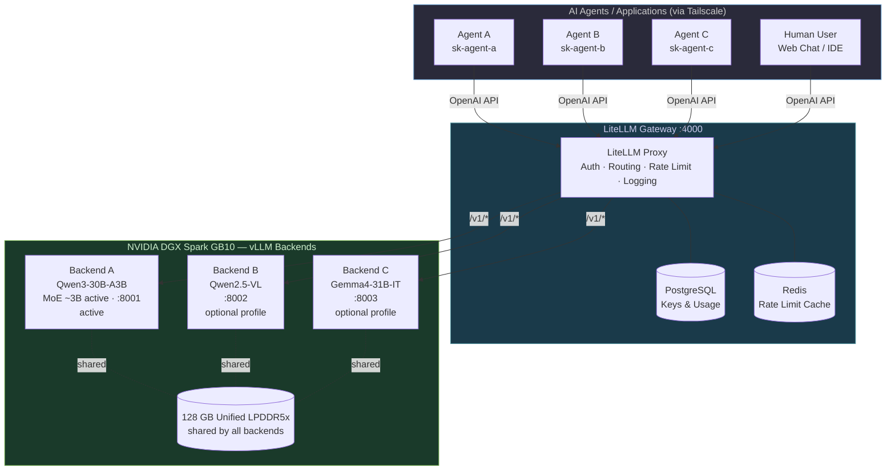
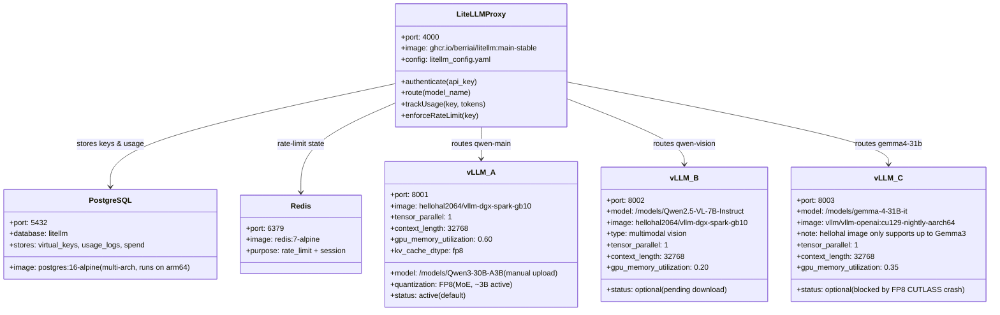
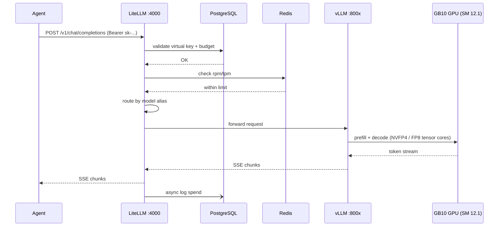

# Tonic NVIDIA DGX Spark (GB10) — LiteLLM + vLLM Production Deployment Manual

> **Repository:** [tonylnng/tonic-nvidia-dgx](https://github.com/tonylnng/tonic-nvidia-dgx)
> **Target Hardware:** NVIDIA DGX Spark — GB10 Grace Blackwell Superchip (ARM64, SM 12.1, 128 GB unified LPDDR5x)
> **Stack:** LiteLLM Gateway · vLLM Backend A `qwen-main` (Qwen3-30B-A3B, active) · vLLM Backend B `qwen-vision` (Qwen2.5-VL, optional / not yet downloaded) · vLLM Backend C `gemma4-31b` (Gemma4-31B-IT, optional / pending FP8 CUTLASS fix)
> **Model delivery:** manually downloaded from HF web UI → rsync to `/data/huggingface/manual/` → mounted read-only as `/models` inside every vLLM container. See [docs/MANUAL_MODEL_UPLOAD.md](docs/MANUAL_MODEL_UPLOAD.md) and the operational reference [docs/VLLM-SETUP.md](docs/VLLM-SETUP.md).
> **Network:** Tailscale-only access (no public exposure)
> **Last Updated:** July 2026

---

## GB10 Platform at a Glance

This manual targets a single **NVIDIA DGX Spark** built on the **GB10 Grace Blackwell Superchip**. Every command, image tag, and tuning parameter has been validated for this hardware.

| Attribute | Value |
|-----------|-------|
| SoC | GB10 Grace Blackwell Superchip (ARM64 / aarch64) |
| GPU compute capability | SM 12.1 (Blackwell, consumer-class tensor cores with native FP4) |
| Peak AI compute | ~1 PFLOPS sparse FP4 (~500 TFLOPS dense FP4) ([NVIDIA DGX Spark hardware docs](https://docs.nvidia.com/dgx/dgx-spark/hardware.html)) |
| Memory model | 128 GB LPDDR5x, unified and coherent (CPU + GPU share one pool) |
| Usable memory | ~119–122 GiB visible to CUDA after OS reservation ([Rafay benchmarks](https://rafay.co/ai-and-cloud-native-blog/serving-llms-on-arm-running-rafay-token-factory-on-nvidia-dgx-spark)) |
| Memory bandwidth | **273 GB/s** (this is the ceiling that governs decode speed) |
| CUDA | 13.x mandatory (CUDA 12.x does not support SM 12.1) |
| Tensor parallelism | 1 (single integrated GPU); scale-out only via ConnectX-7 to a second Spark |
| `nvidia-smi` memory column | Reports `N/A` on unified memory — use `free -h` instead |

**Design rules that follow from this hardware:**

- vLLM `--tensor-parallel-size 1` everywhere.
- Prefer **NVFP4** > FP8 > FP16 wherever a checkpoint exists — the platform is memory-bandwidth-bound, so every bit shaved off weights and KV directly buys tokens/sec.
- `--kv-cache-dtype fp8` is not optional in production — it is the single biggest throughput knob.
- `--gpu-memory-utilization` carves out of the *shared* 128 GB pool; set per backend, and keep the **active backend ≤ 0.85** to leave headroom for the ARM CPU, the OS, and page cache.
- **The GB10 cannot run two vLLM instances simultaneously in production.** Model weights alone consume 30–110 GiB depending on the model, and two live containers cause OOM hangs during KV warm-up. Only **one** of `vllm-qwen-main` / `vllm-qwen-vision` / `vllm-gemma4-31b` runs at a time; swap with `docker stop` → `docker compose up -d <other>` (see [§6.4](#64-running-only-one-vllm-at-a-time)) or the `scripts/swap.sh` pattern in [§12](#12-maintenance-routine--model-updates).

---

## Model Capacity on GB10 — What Actually Fits & How Fast

The 128 GB unified pool is generous — models that would need a multi-GPU box in HBM will *load* here. But the **273 GB/s** LPDDR5x bandwidth caps decode (token-generation) speed to roughly `bandwidth ÷ weight_bytes_read_per_token`. NVIDIA's official ceiling is **200B parameters at FP4 on one Spark**, and **405B across two Sparks** linked by ConnectX-7 ([NVIDIA DGX Spark datasheet, TD Synnex PDF](https://www.tdsynnex.com/na/us/nvidia/wp-content/uploads/sites/81/2025/08/workstation-datasheet-dgx-spark-gtc25-spring-partner-us-4015500-r1.pdf)). Whether it is *usable* at that ceiling depends on decode throughput.

A reasonable rule of thumb, from community benchmarks:

> Anything **≥ 25 tok/s** decode feels responsive for interactive chat.
> **10–25 tok/s** is acceptable for reasoning and long-form generation.
> **< 10 tok/s** is batch-only.

### Recommended sweet-spots for this deployment

| Tier | Model class | Precision | Loaded size | Decode tok/s (1 stream) | Verdict on GB10 |
|------|-------------|-----------|------------:|------------------------:|-----------------|
| S — Interactive | Nemotron-3-Nano-4B / Llama 3.1 8B | FP8 / NVFP4 | ~4–8 GB | ~40–70 (batch 1) → **~368 (batch 32)** | Real-time chat, orchestration, routing |
| S — Interactive | Qwen3-VL-30B-A3B (MoE, ~3B active) | FP8 | ~30 GB | ~52 | Excellent vision + chat |
| M — Balanced | Qwen3.5-35B / Nemotron-3-30B-A3B MoE | NVFP4 | ~20–35 GB | ~50–66 | The GB10 comfort zone |
| M — Balanced | Gemma4-31B / Qwen3 32B | NVFP4 | ~22 GB | ~50–60 | Great for long-context (131K) tool calling |
| **L — Sweet spot** | **GPT-OSS-120B (MoE, ~5B active)** | **MXFP4** | **~65–70 GB** | **~56–60 single stream; ~125 aggregate at 10 concurrent** | **Best 120B option on a single Spark by a wide margin** |
| L — Reasoning | **Qwen3.5-122B-A10B (MoE, ~10B active)** | FP8 / INT4 AutoRound | ~80–90 GB | ~38–42 (FP8, 1 stream); ~25 per request at concurrency 4 | Usable for reasoning; slower than GPT-OSS-120B because 10B active > 5B active |
| L — Reasoning | Nemotron-3-Super-120B-A12B | NVFP4 | ~65 GB | ~14 | Runs, but slow — reserve for batch |
| XL — Ceiling | Dense 70B (Llama 3.1 70B FP8) | FP8 | ~70 GB | **~2.7** | Loads fine, decode too slow for chat |
| XL — Ceiling | Qwen3 200B / DeepSeek-R1 quantized | NVFP4 / Q4 | ~110–120 GB | 5–15 (project-dependent) | Fits at NVFP4; single-stream only; near the ceiling |
| Out of scope | Dense ≥ 200B (e.g. Qwen3-VL-235B FP16) | FP16 / FP8 | > 128 GB | — | Does not fit; needs 2-Spark cluster or cloud |

> **Data sources (measured, not marketing):** LMSYS DGX Spark deep-dive with SGLang and Ollama ([lmsys.org](https://www.lmsys.org/blog/2025-10-13-nvidia-dgx-spark/)); NVIDIA Developer Forums — LiteLLM + llama-swap + vLLM stack benchmarks by @eugr with `llama-benchy` ([forums.developer.nvidia.com](https://forums.developer.nvidia.com/t/running-a-full-llm-stack-on-dgx-spark-gb10-your-application-litellm-llama-swap-vllm-llama-cpp-ollama/367580)); Exxact model-by-model throughput table ([exxactcorp.com](https://www.exxactcorp.com/blog/hpc/nvidia-dgx-spark-ai-supercomputer-wherever-you-go)); vLLM-on-GB10 tuning writeup at [ai-muninn.com](https://ai-muninn.com/en/blog/part2-gpt-oss-120b-serve-script); Cline SIGKILL-race analysis ([cline.ghost.io](https://cline.ghost.io/what-a-sigkill-race-reveals-about-inference-speed/)).

### Why the 120B MoE tier is the sweet spot

Decode speed on GB10 is set by *how many bytes of weight get read per token*. Dense models read the whole model per token; **Mixture-of-Experts (MoE)** models read only the active experts, so a 120B MoE with 5B active behaves closer to a 5B dense model on the memory bus while keeping the quality of a 120B parameter count. Concretely:

- **GPT-OSS-120B (MoE, MXFP4, ~5B active)** → ~56–60 tok/s single stream, ~125 tok/s aggregate at 10 concurrent requests ([NVIDIA Developer Forums](https://forums.developer.nvidia.com/t/dgx-spark-the-sovereign-ai-stack-dual-model-architecture-for-local-inference/352267))
- **Qwen3.5-122B-A10B (MoE, ~10B active, FP8)** → ~40 tok/s single stream, ~25 tok/s per request at concurrency 4 ([NVIDIA Developer Forums bfloat16/MTP benchmark](https://forums.developer.nvidia.com/t/bfloat16-quality-speed/366828))
- **Llama 3.1 70B (dense, FP8)** → **~2.7 tok/s** — reads the full 70 GB per token; effectively unusable for chat ([LMSYS](https://www.lmsys.org/blog/2025-10-13-nvidia-dgx-spark/))

### Practical picks for this stack

| Role | Recommended default | Alternative for max quality | Alternative for max speed |
|------|---------------------|-----------------------------|---------------------------|
| Main reasoning / coding (EN & ZH) | **Qwen3.5-122B-A10B FP8** | Qwen3.5-122B INT4 AutoRound (~90 GB, similar quality, lower memory) | **GPT-OSS-120B MXFP4** (faster; different tone) |
| Fast tool-calling, 128K context | **Gemma4-31B NVFP4** | Qwen3 32B NVFP4 | Nemotron-3-30B-A3B MoE (~66 tok/s) |
| Multimodal vision | **Qwen2.5-VL-7B-FP4** (~7 GB, quick) | Qwen3-VL-30B-A3B FP8 (~52 tok/s, better vision) | Same |
| Small routing / classification | Llama 3.1 8B NVFP4 | Nemotron-3-Nano-4B FP8 | Same |

### When you need bigger than 128 GB

Two paths, in order of preference:

1. **2-Spark cluster over ConnectX-7 (200 GbE):** reaches ~256 GB unified across the pair; enables NVFP4 models up to ~405B. Qwen3-235B NVFP4 has been measured at ~23,477 tok/s prefill and ~11.7 tok/s decode on dual Spark ([Exxact](https://www.exxactcorp.com/blog/hpc/nvidia-dgx-spark-ai-supercomputer-wherever-you-go)).
2. **LiteLLM cloud fallback** — keep a `gpt-premium` / `claude-premium` alias in `config/litellm_config.yaml` for the rare requests that exceed local capacity.

---

## Table of Contents

1. [Architecture Overview](#1-architecture-overview)
2. [Component Diagram](#2-component-diagram)
3. [Request Flow](#3-request-flow)
4. [Prerequisites — GB10 Spark Specifics](#4-prerequisites--gb10-spark-specifics)
5. [Installation SOP — Step by Step](#5-installation-sop--step-by-step)
6. [vLLM Backend Configuration](#6-vllm-backend-configuration)
   - [6.1 Backend A — Qwen3-30B-A3B (`qwen-main`)](#61-backend-a--qwen3-30b-a3b-qwen-main)
   - [6.2 Backend B — Qwen2.5-VL (`qwen-vision`)](#62-backend-b--qwen25-vl-qwen-vision)
   - [6.3 Backend C — Gemma4-31B-IT (`gemma4-31b`)](#63-backend-c--gemma4-31b-it-gemma4-31b)
   - [6.4 Running only one vLLM at a time](#64-running-only-one-vllm-at-a-time)
7. [LiteLLM Gateway Configuration](#7-litellm-gateway-configuration)
8. [Docker Compose — Full Stack](#8-docker-compose--full-stack)
9. [Version Control Strategy for vLLM Images](#9-version-control-strategy-for-vllm-images)
10. [Performance Tuning for High-Throughput Serving on GB10](#10-performance-tuning-for-high-throughput-serving-on-gb10)
11. [Monitoring (Unified Memory & GPU)](#11-monitoring-unified-memory--gpu)
12. [Maintenance Routine — Model Updates](#12-maintenance-routine--model-updates)
13. [Backup and Restore](#13-backup-and-restore)
14. [Troubleshooting](#14-troubleshooting)
15. [Tailscale Access](#15-tailscale-access)
16. [FAQ](#16-faq)

---

## 1. Architecture Overview



---

## 2. Component Diagram



---

## 3. Request Flow



---

## 4. Prerequisites — GB10 Spark Specifics

### 4.1 OS & Driver baseline

DGX Spark ships with **NVIDIA DGX OS** (Ubuntu 24.04 ARM64). Verify before installing anything:

```bash
# 1. ARM64 confirmation
uname -m                       # Expect: aarch64

# 2. DGX OS confirmation
cat /etc/os-release | head -3

# 3. NVIDIA driver — must be CUDA 13.x capable (R580+)
nvidia-smi                     # Expect: Driver 580+ / CUDA 13.x
# NOTE: 'GPU Memory-Usage' will show N/A — this is expected on unified memory.

# 4. Compute capability — must be 12.1
nvidia-smi --query-gpu=compute_cap --format=csv,noheader
# Expect: 12.1

# 5. Free unified memory available — this is your VRAM
free -h
# Expect ~119 GiB total

# 6. Container runtime
docker --version               # >= 25.0
docker compose version         # >= 2.24

# 7. NVIDIA Container Toolkit (must support CDI on aarch64)
nvidia-ctk --version           # >= 1.16
```

### 4.2 Install / upgrade NVIDIA Container Toolkit (aarch64)

```bash
distribution=$(. /etc/os-release;echo $ID$VERSION_ID) \
  && curl -fsSL https://nvidia.github.io/libnvidia-container/gpgkey \
      | sudo gpg --dearmor -o /usr/share/keyrings/nvidia-container-toolkit-keyring.gpg \
  && curl -s -L https://nvidia.github.io/libnvidia-container/stable/deb/nvidia-container-toolkit.list \
      | sed 's#deb https://#deb [signed-by=/usr/share/keyrings/nvidia-container-toolkit-keyring.gpg] https://#g' \
      | sudo tee /etc/apt/sources.list.d/nvidia-container-toolkit.list

sudo apt-get update
sudo apt-get install -y nvidia-container-toolkit
sudo nvidia-ctk runtime configure --runtime=docker
sudo nvidia-ctk cdi generate --output=/etc/cdi/nvidia.yaml
sudo systemctl restart docker

# Smoke test — must list the GB10
docker run --rm --gpus all nvcr.io/nvidia/cuda:13.0.0-base-ubuntu24.04 nvidia-smi
```

### 4.3 Disk layout

Model cache and databases live on the internal 4 TB NVMe. Use the helper script:

```bash
sudo mkdir -p /data                     # if it doesn't already exist
./scripts/init-data-dirs.sh             # creates subdirs with correct perms (asks for sudo on first run)
```

The script creates:

| Path | Perms | Purpose |
|------|-------|---------|
| `/data/huggingface` | 755 | HF cache (for models fetched via HF API) |
| `/data/huggingface/manual` | 755 | **Manually-uploaded model folders (default source)** |
| `/data/postgres` | 700 | LiteLLM DB (keys, spend, usage) |
| `/data/redis` | 700 | LiteLLM rate-limit cache |
| `/data/litellm-logs` | 755 | JSON request logs |
| `/data/backups` | 755 | `pg_dump` output from `scripts/backup-db.sh` |

All directories are owned by your user so subsequent operations (`docker compose`, `rsync`, `scripts/backup-db.sh`) do not need sudo.

### 4.4 Hugging Face token

```bash
# Only needed if you plan to have vLLM fetch models via HF repo-id on first start.
# For the default workflow (manual upload of model folders to /data/huggingface/manual)
# no HF token is required on the Spark itself — HF access happens from your laptop.
# Generate a read token at https://huggingface.co/settings/tokens if you want it.
```

---

## 5. Installation SOP — Step by Step

### Step 1 — Clone

```bash
cd ~
git clone https://github.com/tonylnng/tonic-nvidia-dgx.git
cd tonic-nvidia-dgx
```

### Step 2 — Configure environment

```bash
cp .env.example .env
$EDITOR .env
```

Required values are documented in [`.env.example`](.env.example).

### Step 3 — Pull pinned Docker images (ARM64, GB10)

> Always pin to a digest in production. See [§9 Version Control Strategy](#9-version-control-strategy-for-vllm-images).

```bash
# GB10-compatible vLLM image for Backends A and B (ARM64 + SM 12.1 + CUDA 13)
# Community GB10 image — currently pinned in config/image-versions.env as VLLM_IMAGE.
# It supports models up to Gemma3; for Gemma4 use the NVIDIA nightly below.
docker pull hellohal2064/vllm-dgx-spark-gb10:latest

# vLLM nightly for Backend C — required because hellohal2064 does not yet ship
# the Gemma4ForConditionalGeneration registry. Referenced directly in docker-compose.yml.
docker pull vllm/vllm-openai:cu129-nightly-aarch64

# LiteLLM (multi-arch)
docker pull ghcr.io/berriai/litellm:main-stable

# Datastore (multi-arch)
docker pull postgres:16-alpine
docker pull redis:7-alpine
```

> **After UAT**, replace the floating tag in [`config/image-versions.env`](config/image-versions.env) with a pinned `@sha256:` digest. See [§9](#9-version-control-strategy-for-vllm-images) for the promotion procedure. Note that `vllm-gemma4-31b` in `docker-compose.yml` intentionally references its image directly and does **not** consume `${VLLM_IMAGE}`.

### Step 4 — Place model files under `/data/huggingface/manual/`

The default workflow is **manual upload from a machine with HF web access** — see the full guide in [`docs/MANUAL_MODEL_UPLOAD.md`](docs/MANUAL_MODEL_UPLOAD.md). Short version:

1. On your laptop, browse each HF model page and download every file in the "Files and versions" root into a local folder named exactly like the folder the compose file expects (no quant suffix in the folder name — vLLM reads the quant from the model's own `config.json`):
   - [`Qwen/Qwen3-30B-A3B`](https://huggingface.co/Qwen/Qwen3-30B-A3B) → `~/Downloads/Qwen3-30B-A3B/` (~60 GB across 16 shards; the compose default runs this at FP8 KV cache)
   - [`Qwen/Qwen2.5-VL-7B-Instruct`](https://huggingface.co/Qwen/Qwen2.5-VL-7B-Instruct) → `~/Downloads/Qwen2.5-VL-7B-Instruct/` (~16 GB; optional — pending download)
   - [`google/gemma-4-31B-it`](https://huggingface.co/google/gemma-4-31B-it) → `~/Downloads/gemma-4-31B-it/` (~62 GB BF16; optional — blocked, see §6.3)
2. Upload to the Spark over Tailscale:
   ```bash
   rsync -avhP ~/Downloads/Qwen3-30B-A3B/ \
     tony@spark.<tailnet>.ts.net:/data/huggingface/manual/Qwen3-30B-A3B/
   ```
3. Verify each upload on the Spark:
   ```bash
   scripts/verify-model.sh /data/huggingface/manual/Qwen3-30B-A3B
   ```

`docker-compose.yml` mounts `/data/huggingface/manual` as `/models:ro` inside every vLLM container, so the default `MODEL_PATH=/models/Qwen3-30B-A3B` (see §6.1) picks up the folder automatically.

> **If the Spark can reach HF directly** (and you have a valid `HF_TOKEN` in `.env`), you can skip the manual upload — override `QWEN_MAIN_MODEL=Qwen/Qwen3-30B-A3B` in `.env` and vLLM will fetch on first start. In practice, direct HF pulls have been unreliable from this Spark, so manual upload is the recommended default.

### Step 5 — Bring up the stack

```bash
docker compose up -d
docker compose ps     # all services should be "Up" / "healthy"
```

### Step 6 — Verify

```bash
./scripts/healthcheck.sh
# Or manually:
curl -sf http://localhost:8001/health && echo "qwen-main OK"
curl -sf http://localhost:8002/health && echo "qwen-vision OK"    # only if vllm-qwen-vision is running
curl -sf http://localhost:8003/health && echo "gemma4-31b OK"      # only if vllm-gemma4-31b is running
curl -sf http://localhost:4000/health && echo "litellm OK"         # see LiteLLM (unhealthy) note in §7
```

### Step 7 — Open the LiteLLM Admin UI

```
http://<tailscale-ip>:4000/ui
```
Login with `LITELLM_MASTER_KEY` from `.env`.

---

## 6. vLLM Backend Configuration

> **Universal GB10 flags** for every backend:
> - `--tensor-parallel-size 1` (single GPU)
> - `--dtype auto` (lets vLLM pick optimal precision for SM 12.1)
> - `--kv-cache-dtype fp8` (saves unified-memory bandwidth — biggest single-knob speedup)
> - `--enable-chunked-prefill` (smooth latency under concurrent load)
> - `--max-num-batched-tokens 8192` (good GB10 default; tune per §10)
> - `--swap-space 0` (DO NOT use; swap to LPDDR5x hurts the unified pool)
> - `--enforce-eager false` (let CUDA graphs run — major Blackwell win)
>
> **`hellohal2064` image quirk** (applies to Backends A and C, since C also uses `hellohal2064` as its `<<: *vllm-common` template but overrides the image): the container entrypoint reads `MODEL_PATH`, `GPU_MEMORY_UTIL`, `MAX_MODEL_LEN`, `ATTENTION_BACKEND`, `TOOL_CALL_PARSER`, `REASONING_PARSER`, and `ENABLE_THINKING` from **env vars** — do **not** pass `--model` as the first CLI argument. The compose file already wires these correctly; standalone `docker run` examples below reflect the same pattern.

### 6.1 Backend A — Qwen3-30B-A3B (`qwen-main`)

Default reasoning / coding backend and the **only vLLM container running by default**. MoE architecture with only ~3B active parameters per token → ~110–130 tok/s decode on GB10.

| | |
|---|---|
| Model | `Qwen/Qwen3-30B-A3B` (MoE, ~3B active) |
| Local path | `/models/Qwen3-30B-A3B` (mounted from `/data/huggingface/manual/Qwen3-30B-A3B`) |
| Container | `tonic-vllm-qwen-main` |
| Port | `127.0.0.1:8001` |
| Image | `hellohal2064/vllm-dgx-spark-gb10:latest` |
| Served name (LiteLLM alias) | `qwen-main` |
| Memory utilization | `0.60` (`.env` → `QWEN_MAIN_MEM_UTIL`; carves ~73 GiB out of the 121 GiB unified pool, leaves ~48 GiB for OS + Docker + page cache) |
| KV cache dtype | `fp8` |
| `max-model-len` | `32768` |
| `max-num-batched-tokens` | `8192` |
| `max-num-seqs` | `64` |
| Tool-call parser | `hermes` |
| Reasoning parser | `qwen3` |
| Thinking mode | `ENABLE_THINKING=true` |
| Startup | 16 shards × ~3.6 GiB → ~6–7 min cold load. Health probe shows `(health: starting)` for the first ~7 min; confirm with `docker logs tonic-vllm-qwen-main --tail 10`. |
| Best for | fast reasoning, tool calling, coding, EN/ZH |

The full compose-managed launch is in [`docker-compose.yml`](docker-compose.yml). To run it standalone for debugging, remember the `hellohal2064` env-var contract:

```bash
docker run -d \
  --name tonic-vllm-qwen-main \
  --restart unless-stopped \
  --gpus all \
  --ipc host \
  --ulimit memlock=-1 --ulimit stack=67108864 \
  --shm-size 8g \
  -p 8001:8000 \
  -e VLLM_USE_TRITON_FLASH_ATTN=1 \
  -e VLLM_ATTENTION_BACKEND=FLASHINFER \
  -e MODEL_PATH=/models/Qwen3-30B-A3B \
  -e HOST=0.0.0.0 \
  -e PORT=8000 \
  -e MAX_MODEL_LEN=32768 \
  -e GPU_MEMORY_UTIL=0.60 \
  -e ATTENTION_BACKEND=FLASHINFER \
  -e TOOL_CALL_PARSER=hermes \
  -e REASONING_PARSER=qwen3 \
  -e ENABLE_THINKING=true \
  -v /data/huggingface:/root/.cache/huggingface \
  -v /data/huggingface/manual:/models:ro \
  hellohal2064/vllm-dgx-spark-gb10:latest \
  --served-model-name qwen-main \
  --tensor-parallel-size 1 \
  --kv-cache-dtype fp8 \
  --enable-chunked-prefill \
  --max-num-batched-tokens 8192 \
  --max-num-seqs 64 \
  --disable-log-requests
```

**Want a larger model as `qwen-main`?** Manually upload it into `/data/huggingface/manual/<folder>/`, then set `QWEN_MAIN_MODEL=/models/<folder>` and (for a 122B-class model) `QWEN_MAIN_MEM_UTIL=0.85` in `.env`, and `docker compose up -d --force-recreate vllm-qwen-main`. All other config stays the same — LiteLLM keeps routing the alias `qwen-main` to whichever model is loaded.

**Smoke test:**
```bash
curl http://localhost:8001/v1/chat/completions \
  -H "Content-Type: application/json" \
  -d '{"model":"qwen-main","messages":[{"role":"user","content":"Hello"}],"max_tokens":50}'
```

### 6.2 Backend B — Qwen2.5-VL (`qwen-vision`)

> The originally-requested **Qwen3-VL-235B requires ≥320 GB VRAM** and cannot run on a single GB10. Below is the GB10-feasible vision option. To run a larger vision model, link two Sparks via the ConnectX-7 200 Gb/s port and follow NVIDIA's two-node Spark recipe — out of scope for this guide.

> ⏳ **Status:** in the `optional` Compose profile and **not yet downloaded**. Pending: place `Qwen2.5-VL-7B-Instruct` under `/data/huggingface/manual/`. This service does **not** auto-start.

| | |
|---|---|
| Model | `Qwen/Qwen2.5-VL-7B-Instruct` |
| Local path | `/models/Qwen2.5-VL-7B-Instruct` |
| Container | `tonic-vllm-qwen-vision` |
| Port | `127.0.0.1:8002` |
| Compose profile | `optional` — start with `--profile optional up -d vllm-qwen-vision` |
| Memory utilization | `0.20` |

```bash
# Standalone launch (for debugging). In production start via the optional profile.
docker run -d \
  --name tonic-vllm-qwen-vision \
  --restart unless-stopped \
  --gpus all \
  --ipc host \
  --ulimit memlock=-1 --ulimit stack=67108864 \
  --shm-size 4g \
  -p 8002:8000 \
  -v /data/huggingface:/root/.cache/huggingface \
  -v /data/huggingface/manual:/models:ro \
  hellohal2064/vllm-dgx-spark-gb10:latest \
  --model /models/Qwen2.5-VL-7B-Instruct \
  --served-model-name qwen-vision \
  --tensor-parallel-size 1 \
  --max-model-len 32768 \
  --gpu-memory-utilization 0.20 \
  --kv-cache-dtype fp8 \
  --enable-chunked-prefill \
  --trust-remote-code \
  --limit-mm-per-prompt image=6,video=1 \
  --host 0.0.0.0
```

### 6.3 Backend C — Gemma4-31B-IT (`gemma4-31b`)

> ⚠️ **Not in an optional Compose profile** — unlike `vllm-qwen-vision`, this is a regular service and simply is not started by default because the GB10 cannot run two vLLM instances at once. Start it explicitly (see [§6.4](#64-running-only-one-vllm-at-a-time)).

> ⚠️ **Currently blocked by an FP8 CUTLASS crash on SM 12.1** (as of 2026-07-05). The `cutlass_scaled_mm` kernel in `vllm/vllm-openai:cu129-nightly-aarch64` faults with `cutlass_gemm_caller Error Internal` after model load, during KV cache warm-up. `--enforce-eager` does **not** work around it. Pending fix: drop `--quantization fp8` and `--kv-cache-dtype fp8` and run native BF16 (will need `GEMMA4_31B_MEM_UTIL≈0.90`+).

| | |
|---|---|
| Model | `google/gemma-4-31B-it` |
| Local path | `/models/gemma-4-31B-it` |
| Container | `tonic-vllm-gemma4-31b` |
| Port | `127.0.0.1:8003` |
| Image | `vllm/vllm-openai:cu129-nightly-aarch64` (**not** `${VLLM_IMAGE}` — hellohal2064 only ships Gemma3 support) |
| Served name | `gemma4-31b` |
| Memory utilization | `0.35` (`.env` → `GEMMA4_31B_MEM_UTIL`) |
| `max-model-len` | `32768` |
| `max-num-batched-tokens` | `4096` |
| `max-num-seqs` | `32` |
| `--enforce-eager` | set (disables CUDA graph capture) |
| Best for | low-latency, tool calling |

```bash
# Standalone launch shown for reference — subject to the CUTLASS FP8 crash noted above.
docker run -d \
  --name tonic-vllm-gemma4-31b \
  --restart unless-stopped \
  --gpus all \
  --ipc host \
  --ulimit memlock=-1 --ulimit stack=67108864 \
  --shm-size 4g \
  -p 8003:8000 \
  -v /data/huggingface:/root/.cache/huggingface \
  -v /data/huggingface/manual:/models:ro \
  vllm/vllm-openai:cu129-nightly-aarch64 \
  --model /models/gemma-4-31B-it \
  --served-model-name gemma4-31b \
  --tensor-parallel-size 1 \
  --max-model-len 32768 \
  --gpu-memory-utilization 0.35 \
  --max-num-batched-tokens 4096 \
  --max-num-seqs 32 \
  --enforce-eager \
  --enable-chunked-prefill \
  --enable-auto-tool-choice \
  --tool-call-parser gemma4 \
  --trust-remote-code \
  --host 0.0.0.0
```

### 6.4 Running only one vLLM at a time

Model weights and KV cache alone consume 30–110 GiB per backend, and the GB10's 121 GiB unified pool has to hold the OS, Docker, and page cache as well. Two live vLLM containers reliably OOM during KV warm-up. **In production, run exactly one vLLM service at a time.**

```bash
# Swap: stop Qwen, start Gemma4
docker stop tonic-vllm-qwen-main
docker compose --env-file .env --env-file config/image-versions.env up -d vllm-gemma4-31b

# Swap back: stop Gemma4, start Qwen
docker stop tonic-vllm-gemma4-31b
docker compose --env-file .env --env-file config/image-versions.env up -d vllm-qwen-main

# Start the vision profile (still requires stopping whatever is on the GPU first)
docker stop tonic-vllm-qwen-main
docker compose --env-file .env --env-file config/image-versions.env --profile optional up -d vllm-qwen-vision
```

`scripts/swap.sh` in [§12](#12-maintenance-routine--model-updates) wraps this pattern with a health-check gate.

---

## 7. LiteLLM Gateway Configuration

See [`config/litellm_config.yaml`](config/litellm_config.yaml). Key sections:

- `model_list` — three local backends + optional cloud fallback
- `router_settings` — retries, cooldown, simple-shuffle fallback
- `general_settings` — master key from env, PostgreSQL DB, Redis cache
- `litellm_settings` — request timeout 600s for long generations on GB10

### 7.1 LiteLLM health check shows `(unhealthy)` — usually expected

LiteLLM's `/health/liveliness` endpoint can return non-200 even when the proxy is routing requests successfully — it flips to unhealthy whenever **any** entry in `model_list` is unreachable (very common in this deployment because `qwen-vision` and `gemma4-31b` are only up on demand) or during LiteLLM's own startup. The gateway is actually functional as long as `/health` returns a JSON body.

```bash
# Verify the gateway is really alive (ignore the container's health column)
curl -s http://127.0.0.1:4000/health | jq .

# List the models LiteLLM currently thinks are online
curl -s -H "Authorization: Bearer $LITELLM_MASTER_KEY" \
  http://127.0.0.1:4000/v1/models | jq '.data[].id'
```

### 7.2 Container health legend for vLLM

| Status | Meaning |
|--------|---------|
| `(healthy)` | Model loaded and accepting requests |
| `(health: starting)` | Still loading shards — normal for the first 7–10 min on `qwen-main` |
| `(unhealthy)` | Either still loading beyond the start-period, or crashed — check `docker logs <container> --tail 20` |

GPU clock idles at ~300 MHz and jumps to ~2444 MHz once inference actually begins.

---

## 8. Docker Compose — Full Stack

See [`docker-compose.yml`](docker-compose.yml). Highlights tailored for GB10:

- All services declare `platform: linux/arm64` to prevent accidental amd64 pulls.
- vLLM services share `/data/huggingface` (one model cache for all three).
- vLLM services use **`shm_size: 8g`** and `ipc: host` (mandatory on GB10).
- Healthchecks run against `/health` with a 60 s start period (model load takes 30–90 s).
- All listening ports bind to `127.0.0.1` — external access is via Tailscale only (see §15).

Bring up:

```bash
docker compose up -d
docker compose logs -f litellm
```

---

## 9. Version Control Strategy for vLLM Images

### 9.1 Why pin

vLLM ships breaking changes on a roughly monthly cadence. On GB10 in particular, several minor versions have known regressions (`0.15.x` is broken on SM 12.1 — use `0.14.1` or `0.17.1+`). Production must never `:latest`.

### 9.2 The pinning scheme

We keep **three layers** of identifiers in [`config/image-versions.env`](config/image-versions.env):

| Layer | Example | When it changes |
|-------|---------|-----------------|
| **Tag** (human-readable) | `hellohal2064/vllm-dgx-spark-gb10:v0.17.1` | Quarterly review |
| **Digest** (immutable) | `sha256:abc123…` | Frozen the moment a tag passes UAT |
| **Channel** | `stable` / `canary` / `rollback` | Promotion gate |

`docker-compose.yml` references the **digest**, not the tag. Tags drift, digests don't.

```bash
# Resolve and capture the current digest after a successful UAT run:
docker buildx imagetools inspect hellohal2064/vllm-dgx-spark-gb10:v0.17.1 \
  --format '{{json .Manifest}}' | jq -r '.digest'
```

### 9.3 Branching model (this repo)

```
main         → mirrors stable channel; protected; deploys to production via tag push
develop      → integration branch for image bumps and config tweaks
release/*    → version bump candidates undergoing UAT
hotfix/*     → emergency patches; fast-forwarded into main with retroactive PR
```

### 9.4 Upgrade workflow

1. Open a `release/vllm-0.18.0` branch.
2. Bump only the `VLLM_IMAGE` digest in [`config/image-versions.env`](config/image-versions.env).
3. `docker compose -f docker-compose.yml -f docker-compose.canary.yml up -d` — runs the new image on port `:8011/:8012/:8013` (`canary` LiteLLM model aliases).
4. Run [`scripts/benchmark.sh`](scripts/benchmark.sh) and compare against the previous baseline saved in `docs/benchmarks/`.
5. If pass → merge to `main` and run `scripts/update-rolling.sh` (see §12).
6. Tag the commit `vllm-2026.06.30` and create a GitHub Release with the benchmark artifact attached.

### 9.5 Image registry mirror

```bash
# Mirror the pinned image to a private GHCR repo for offline / Tailscale-only restore
docker tag hellohal2064/vllm-dgx-spark-gb10@sha256:abc... \
  ghcr.io/tonylnng/vllm-dgx-spark-gb10:v0.17.1
docker push ghcr.io/tonylnng/vllm-dgx-spark-gb10:v0.17.1
```

Full strategy and rationale in [`docs/VERSIONING.md`](docs/VERSIONING.md).

---

## 10. Performance Tuning for High-Throughput Serving on GB10

The GB10 is **memory-bandwidth-bound** (273 GB/s), not compute-bound. Tuning is therefore mostly about (a) shrinking weights/KV (NVFP4, FP8 KV) and (b) maximizing tensor-core occupancy with batched prefill.

### 10.1 The headline knobs (in priority order)

| Knob | Default | Recommended | What it does on GB10 |
|------|---------|-------------|----------------------|
| `--kv-cache-dtype` | `auto` (fp16) | **`fp8`** | Halves KV bandwidth — single biggest GB10 throughput win |
| `--quantization` | (model default) | **`modelopt` (NVFP4)** when available | 4-bit weights → 4× less memory traffic |
| `--enable-chunked-prefill` | off | **on** | Interleaves long-prompt prefill with decode → eliminates head-of-line blocking |
| `--max-num-batched-tokens` | 2048 | **8192** for `qwen-main` (30B); **4096** for `gemma4-31b` / `qwen-vision` | Bigger batches saturate tensor cores |
| `--max-num-seqs` | 256 | **64** (`qwen-main`), **32** (`gemma4-31b`), **16** (`qwen-vision`) | Concurrent-request ceiling; only one vLLM runs at a time so these don't have to sum |
| `--gpu-memory-utilization` | 0.90 | **0.60 / 0.35 / 0.20** for A / C / B (only one active at a time) | Leaves headroom on the *shared* pool |
| `--max-model-len` | (model default) | **32768 / 131072 / 32768** | Long-context costs KV cache; only buy what you need |
| `VLLM_ATTENTION_BACKEND` | auto | **`FLASHINFER`** | The only attention backend that's actually verified on SM 12.1 |
| `--enforce-eager` | false | **false** (leave it off) | CUDA graphs give a 15–25 % decode boost on Blackwell |
| `--disable-log-requests` | false | **true** in prod | Removes per-token Python overhead |
| `--num-scheduler-steps` | 1 | **8** | Lets the scheduler look ahead → fewer GPU bubbles |
| `--swap-space` | 4 GiB | **0** | Swap on unified memory is a footgun |

### 10.2 OS / driver level

```bash
# Lock GPU clocks to max sustained for inference benchmarks
sudo nvidia-smi -pm 1                      # persistence mode on
sudo nvidia-smi -lgc 2400                   # lock graphics clock (GB10 max ≈ 2.42 GHz)
sudo nvidia-smi --auto-boost-default=0      # disable boost variance

# Disable the ARM CPU's energy-saver governor for serving
sudo cpupower frequency-set -g performance

# Lock LPDDR5x memory clock (GB10-specific helper)
sudo dgx-bandwidth --lock-memory-max        # if dgx-tools is installed

# Turn off transparent huge pages for predictable latency
echo never | sudo tee /sys/kernel/mm/transparent_hugepage/enabled
```

### 10.3 Container level

```yaml
# In docker-compose.yml for every vLLM service
ipc: host                   # required for NCCL shared-memory rings
shm_size: "8g"              # vLLM allocator
ulimits:
  memlock: -1
  stack: 67108864
environment:
  VLLM_ATTENTION_BACKEND: FLASHINFER
  VLLM_USE_TRITON_FLASH_ATTN: "1"
  TORCH_NCCL_AVOID_RECORD_STREAMS: "1"
  CUDA_DEVICE_MAX_CONNECTIONS: "1"
  NCCL_CUMEM_ENABLE: "0"                # NCCL on unified memory is buggy below 2.22
  PYTORCH_CUDA_ALLOC_CONF: "expandable_segments:True"
```

### 10.4 LiteLLM-level

```yaml
router_settings:
  num_retries: 2
  retry_after: 5
  allowed_fails: 3
  cooldown_time: 30
  routing_strategy: usage-based-routing-v2   # prefers least-loaded backend
  enable_pre_call_checks: true               # short-circuit OOM before forwarding

litellm_settings:
  request_timeout: 600                       # 122B can hit 300+s for long generations
  drop_params: true
  set_verbose: false
  cache:
    type: redis
    ttl: 600
```

### 10.5 Expected ballpark on GB10 (Qwen3-30B-A3B, fp8 KV, batch 32)

| Phase | Tokens / s |
|-------|------------|
| Qwen3-30B-A3B prefill | ~3,500 t/s |
| Qwen3-30B-A3B decode (single) | ~110–130 t/s |
| Qwen3-30B-A3B decode (batch 16 concurrent) | ~700–850 t/s aggregate |
| Gemma4-31B-IT decode (BF16, once FP8 unblocked) | ~50–60 t/s single seq |
| Qwen2.5-VL-7B decode | ~80–100 t/s single seq |
| (Optional) Qwen3.5-122B-A10B-FP8 decode (single) | ~38–42 t/s |

Full methodology and how to reproduce: [`docs/PERFORMANCE_TUNING.md`](docs/PERFORMANCE_TUNING.md).

---

## 11. Monitoring (Unified Memory & GPU)

### 11.1 Memory — the GB10 rule

> **Do not trust `nvidia-smi` for memory on GB10.** It reports `N/A`. Use `free -h` instead.

```bash
# Real GB10 memory snapshot
free -h
cat /proc/meminfo | grep -E '^(MemTotal|MemAvailable|MemFree|Cached)'

# Per-process unified usage
ps -e -o pid,rss,vsz,comm --sort=-rss | head -20
```

### 11.2 GPU compute

```bash
# Live utilization (compute % only — memory column is N/A)
nvidia-smi --query-gpu=utilization.gpu,temperature.gpu,power.draw,clocks.gr,clocks.mem \
  --format=csv -l 1

# DCGM (recommended for sustained monitoring)
sudo systemctl enable --now nvidia-dcgm
dcgmi dmon -e 1001,1003,1004,1005,1009,1010 -d 1
```

### 11.3 dgxtop

```bash
pip install --user dgxtop
dgxtop
```

### 11.4 LiteLLM dashboard

`http://<tailscale-ip>:4000/ui` → **Usage**. Per-key, per-model, per-time-window.

### 11.5 Prometheus (optional)

```bash
docker compose -f docker-compose.yml -f docker-compose.metrics.yml up -d
# Grafana on :3000 (admin/admin), Prometheus on :9090
```

---

## 12. Maintenance Routine — Model Updates

A monthly cadence is recommended. The full schedule is in [`docs/MAINTENANCE.md`](docs/MAINTENANCE.md).

### 12.1 Weekly (Mon 07:00 HKT — runs from cron)

```bash
scripts/healthcheck.sh             # ping all backends + LiteLLM
scripts/disk-report.sh             # warn if /data > 80 %
docker compose pull                 # only pulls if digest changed
docker images --filter "dangling=true" -q | xargs -r docker rmi
```

### 12.2 Monthly model refresh

```bash
# 1. Pre-flight
./scripts/healthcheck.sh
./scripts/backup-db.sh

# 2. Snapshot current model dirs (in case the new revision regresses)
# For manually-uploaded models — archive the folder before overwriting
mv /data/huggingface/manual/Qwen3-30B-A3B \
   /data/huggingface/hub/_archive/Qwen3-30B-A3B.$(date +%Y%m%d)

# 3. Re-upload the fresh copy from your laptop
# rsync -avhP ~/Downloads/Qwen3-30B-A3B/ \
#   tony@spark.<tailnet>.ts.net:/data/huggingface/manual/Qwen3-30B-A3B/
scripts/verify-model.sh /data/huggingface/manual/Qwen3-30B-A3B

# 4. Canary
docker compose -f docker-compose.yml -f docker-compose.canary.yml up -d vllm-qwen-main-canary
./scripts/benchmark.sh qwen-main-canary > docs/benchmarks/$(date +%Y%m%d)-qwen-main.txt
diff docs/benchmarks/baseline-qwen-main.txt docs/benchmarks/$(date +%Y%m%d)-qwen-main.txt

# 5. Promote (rolling, zero downtime on the other two backends)
./scripts/update-rolling.sh qwen-main

# 6. If regression: rollback
./scripts/rollback.sh qwen-main
```

### 12.3 vLLM image refresh

See [§9](#9-version-control-strategy-for-vllm-images) and `scripts/update-rolling.sh`.

### 12.4 Model-swap pattern (memory-constrained mode)

If you need a model that doesn't fit alongside the others, LiteLLM can hot-swap:

```yaml
# config/litellm_config.yaml — excerpt
model_list:
  - model_name: qwen-large-on-demand
    litellm_params:
      model: openai/qwen-main
      api_base: http://vllm-qwen-main:8000
    model_info:
      load_on_demand: true                # custom flag handled by scripts/swap.sh
```

`scripts/swap.sh qwen-main → gemma4-31b` stops one container and starts the other in <60 s. This is the same pattern documented in [§6.4](#64-running-only-one-vllm-at-a-time) — the two backends cannot be co-resident.

---

## 13. Backup and Restore

### 13.1 PostgreSQL (keys, usage)

```bash
# Manual
./scripts/backup-db.sh

# Cron (already set up by install)
0 2 * * * /home/<user>/tonic-nvidia-dgx/scripts/backup-db.sh
```

Retention: 30 days local + weekly rsync to NAS.

### 13.2 Restore

```bash
./scripts/restore-db.sh backups/litellm_20260629_020000.pgdump
```

### 13.3 Config — Git is the source of truth

Every change to `litellm_config.yaml`, `docker-compose.yml`, `image-versions.env` goes through a PR.

### 13.4 Model weights

Canonical source = Hugging Face. For air-gapped: `rsync -avz /data/huggingface/ nas:/mnt/llm-models/`.

---

## 14. Troubleshooting

### "SM 12.1 not supported" / `unsupported gpu architecture`
You pulled the x86 / non-GB10 vLLM image. Use a GB10-targeted image (see §5 Step 3).

### `nvidia-smi` shows `N/A` for memory
Expected on unified memory. Use `free -h`.

### CUDA OOM, but `free -h` shows free memory
`--gpu-memory-utilization` reserves a hard cap inside vLLM that's lower than what's free in the pool. Increase that flag (cautiously) instead of looking for "more VRAM".

### Container exits with `RuntimeError: CUDA error: no kernel image is available`
The image was built for SM 10.0 / 12.0, not 12.1. Switch to the GB10 build.

### LiteLLM 502
Model is still loading. Spark cold-load takes 30–90 s from local NVMe (longer for 100B+ models). Check `docker logs tonic-vllm-qwen-main`.

### Throughput collapses after 10 min
Thermal throttling. Check `nvidia-smi --query-gpu=temperature.gpu,clocks.gr --format=csv -l 2`. Improve airflow or lower `--max-num-seqs`.

Full table in [`docs/TROUBLESHOOTING.md`](docs/TROUBLESHOOTING.md).

---

## 15. Tailscale Access

This deployment exposes **nothing** to the public internet. All access is over Tailscale.

```bash
# On the Spark
sudo tailscale up --ssh --advertise-tags=tag:dgx
tailscale ip -4              # note the 100.x.x.x address

# All Docker port mappings bind to 127.0.0.1 by default
# Use a Tailscale Serve definition to expose 4000 to your tailnet only:
sudo tailscale serve --bg --https=443 http://127.0.0.1:4000

# From your laptop (also on the tailnet):
curl https://spark.<your-tailnet>.ts.net/v1/models \
  -H "Authorization: Bearer sk-your-virtual-key"
```

For ACL examples that restrict `tag:agent` devices to port 4000 only, see [`docs/TAILSCALE_ACL.md`](docs/TAILSCALE_ACL.md).

---

## 16. FAQ

**Q: Can I really run Qwen3-VL-235B on a single Spark?**
No. It needs ~320 GB VRAM. Options: (a) use the NVFP4 vision model in §6.2; (b) link two Sparks via ConnectX-7 and shard with vLLM `pipeline-parallel-size 2` once that path is stable on GB10; (c) call a cloud model via the LiteLLM fallback.

**Q: Why FP8 KV cache instead of full FP16?**
On the 273 GB/s LPDDR5x pool, decode throughput scales almost linearly with KV bandwidth. FP8 KV roughly doubles decode tokens/s with negligible quality loss for the models listed here.

**Q: Why `tensor-parallel-size 1`?**
A Spark has one GB10. TP > 1 requires multiple GPUs.

**Q: Can I keep `--gpu-memory-utilization 0.90`?**
Don't. On the shared pool, 0.90 leaves only ~12 GB for the ARM CPU, OS, page cache, and any other backend. Stick to the §6 budgets.

**Q: My agent works in Cantonese — which model should it use?**
`qwen-main` (Qwen3-30B-A3B by default). Qwen is trained heavily on ZH/EN and is strong in Cantonese. For maximum quality on complex Cantonese requests, swap to Qwen3.5-122B via `QWEN_MAIN_MODEL` (see §6.1). Remember only one vLLM can run at a time, so any swap-in evicts whatever was running before ([§6.4](#64-running-only-one-vllm-at-a-time)).

**Q: How do I add GPT-5 / Claude as a fallback?**
Uncomment the cloud entries in `config/litellm_config.yaml` and set `OPENAI_API_KEY` / `ANTHROPIC_API_KEY` in `.env`. Restart LiteLLM: `docker compose restart litellm`.

**Q: Where do model weights live?**
`/data/huggingface` on the 4 TB NVMe. ~115 GB total for all three models.

**Q: How do I add a new virtual API key?**
LiteLLM UI → **Virtual Keys** → **Create Key**, or:
```bash
curl -X POST http://localhost:4000/key/generate \
  -H "Authorization: Bearer $LITELLM_MASTER_KEY" \
  -H "Content-Type: application/json" \
  -d '{"key_alias":"agent-coder","models":["qwen-main","gemma4-31b"],"max_budget":100,"tpm_limit":50000,"rpm_limit":60}'
```

---

## Documentation Index

- [docs/VLLM-SETUP.md](docs/VLLM-SETUP.md) — production vLLM backend reference (memory tuning, hellohal2064 env-var contract, one-vLLM-at-a-time workflow, LiteLLM health quirk)
- [docs/MANUAL_MODEL_UPLOAD.md](docs/MANUAL_MODEL_UPLOAD.md) — HF web-download → rsync upload workflow
- [docs/VERSIONING.md](docs/VERSIONING.md) — full version-control strategy
- [docs/PERFORMANCE_TUNING.md](docs/PERFORMANCE_TUNING.md) — every tunable parameter explained
- [docs/MAINTENANCE.md](docs/MAINTENANCE.md) — weekly / monthly / quarterly schedule
- [docs/TROUBLESHOOTING.md](docs/TROUBLESHOOTING.md) — extended error table
- [docs/TAILSCALE_ACL.md](docs/TAILSCALE_ACL.md) — ACL templates
- [CHANGELOG.md](CHANGELOG.md) — release history

---

## Sources & References

- NVIDIA DGX Spark User Guide — [docs.nvidia.com/dgx/dgx-spark](https://docs.nvidia.com/dgx/dgx-spark/hardware.html)
- vLLM Docker docs (aarch64 / Grace-Blackwell) — [docs.vllm.ai/en/stable/deployment/docker](https://docs.vllm.ai/en/stable/deployment/docker/)
- vLLM v0.12.0 SM120 / NVFP4 release notes — [Reddit r/LocalLLaMA](https://www.reddit.com/r/LocalLLaMA/comments/1pe4xm4/vllm_v0120_supports_nvfp4_for_sm120_rtx_50xx_and/)
- NVIDIA Dev Forum — pre-built vLLM for GB10 — [forums.developer.nvidia.com](https://forums.developer.nvidia.com/t/new-pre-built-vllm-docker-images-for-nvidia-dgx-spark/357832)
- shamily/vllm-gb10 reference setup — [github.com/shamily/vllm-gb10](https://github.com/shamily/vllm-gb10)
- LiteLLM Proxy docs — [docs.litellm.ai](https://docs.litellm.ai/docs/proxy/quick_start)

---

*Open issues / questions: [github.com/tonylnng/tonic-nvidia-dgx/issues](https://github.com/tonylnng/tonic-nvidia-dgx/issues)*
